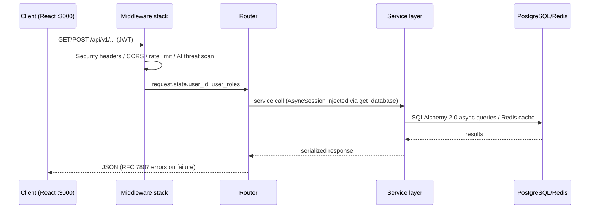

# FundCast Architecture

> Companion to [`PLATFORM_OVERVIEW.md`](./PLATFORM_OVERVIEW.md). This document
> describes the runtime architecture, module layout, and data flow as implemented
> (verified 2026-08-06).

## 1. Repository Layout

```
FundCast/
├── Dockerfile                     # Multi-stage container build
├── docker-compose.yml             # Local stack (api, db, redis)
├── Makefile                       # dev / test / lint / build targets
├── pyproject.toml                 # Package metadata + pytest config
├── requirements*.txt              # Runtime & dev deps
├── package.json                   # Frontend (Vite + React + TS)
├── vite.config.ts                 # Dev server + /api proxy to :8000
├── docs/                          # This documentation set
├── src/
│   ├── api/                       # FastAPI application
│   │   ├── main.py                # create_app() factory, middleware, lifespan
│   │   ├── config.py              # pydantic-settings (env-driven)
│   │   ├── database.py            # SQLAlchemy 2.0 async models + session
│   │   ├── exceptions.py          # FundCastException hierarchy
│   │   ├── middleware.py          # security/request/logging/perf middleware
│   │   ├── cache.py               # L1 in-memory + L2 Redis cache
│   │   ├── async_tasks.py         # priority task queue + @task decorator
│   │   ├── database_optimization.py  # pool manager + query optimizer
│   │   ├── auth/                  # JWT, security, RBAC middleware, router
│   │   ├── users/                 # profile CRUD, role/permission deps
│   │   ├── compliance/            # KYC/KYB, accreditation, Reg CF models
│   │   ├── markets/               # market CRUD + trading order models
│   │   ├── subscriptions/         # tiers, LemonSqueezy, Purple featuring
│   │   └── sre/                   # circuit breaker, SLO, metrics
│   ├── security/                  # AI defense framework (12 symbols)
│   ├── ai_inference/              # semantic search (pgvector)
│   ├── data_pipeline/             # (stub)
│   └── ui/                        # React frontend
│       ├── App.tsx                # shell + client-side nav
│       ├── pages/                 # HomePage, PricingPage
│       ├── components/            # FeaturedFounders, PurpleTierPricing
│       ├── examples/              # scene-system + market-domination demos
│       └── lib/                   # scene system, engagement libs, realtime
└── tests/                         # integration, property, benchmarks
```

## 2. Request Lifecycle



Middleware ordering in `create_app()` (top → first executed):
1. `TrustedHostMiddleware` — allowed host allow-list
2. CORS middleware — configured origins
3. `SecurityHeadersMiddleware` — OWASP headers
4. `LoggingMiddleware` — request ID + structured logs
5. `RequestValidationMiddleware` — content-type + size limits
6. `PerformanceMiddleware` — slow-request detection
7. `RateLimitMiddleware` — Redis-backed with memory fallback
8. `AuthMiddleware` + `RBACMiddleware` — JWT verify + route permissions
9. `AIDefenseMiddleware` — threat detection (prompt injection etc.)

## 3. Data Model (core tables)

| Model | Table | Notes |
|-------|-------|-------|
| `User` | `users` | profile, roles, KYC/accreditation status |
| `Company` | `companies` | issuer profiles, KYB status |
| `Offering` | `offerings` | Reg CF / 506(c) terms, `Decimal` amounts |
| `Investment` | `investments` | commitment records |
| `Market` | `markets` | binary/categorical/scalar + `Vector(384)` embedding |
| `MarketPosition` | `market_positions` | fractional shares (`Numeric(12,6)`) |
| `SubscriptionTier` | `subscription_tiers` | pricing (cents), psychology notes |
| `UserSubscription` | `user_subscriptions` | billing periods, Purple featuring flags |
| `PurpleFeaturingSchedule` | `purple_featuring_schedule` | hero/grid/story rotations |
| `FeaturingImpression` | `featuring_impressions` | per-interaction analytics |

Models use SQLAlchemy 2.0 `DeclarativeBase` with UUID PKs and `created_at` /
`updated_at` on the base. Money is `Numeric` → `Decimal`; shares are fractional.

## 4. Security Modules (`src/security/`)

All 12 public symbols are implemented and importable:

- `AIThreatDetector` / `ThreatAssessment` — multi-stage prompt-injection detection
- `BehavioralAuthenticityAnalyzer` / `AuthenticityScore` — bot-vs-human scoring
- `AdversarialInputNeutralizer` / `NeutralizationResult` — deobfuscation + pattern neutralization
- `IntelligentIncidentResponse` / `ResponseResult` / `SecurityIncident` — response lifecycle
- `ContinuousRedTeamSimulator` / `SimulationReport` — scheduled attack probes
- `PredictionMarketSecurityFramework` / `IntegrityAssessment` — manipulation detection

Heavy ML deps (torch/transformers/sklearn) are **optional**: the detector
degrades to pattern-based detection when they are absent.

## 5. Frontend Architecture

- **Build**: Vite dev server (`:3000`) proxies `/api` → FastAPI `:8000`.
- **Scene System**: `SceneProvider`/`CompleteSceneSystemProvider` expose
  `currentScene`, `transition`, `trackEvent`; `Scene` renders only active scenes.
- **Engagement libs**: streaks, social feed, VIP status, near-miss rendering,
  referral/access-gate/leaderboard surfaces (see `src/ui/lib/`).
- **Realtime**: module-level WebSocket manager with reconnect + throttling;
  `RealtimePrice` subscribes to `price-update` topics.
- **Polygon**: `ethers` v6 is a dependency for future USDC flows (config-gated).

## 6. Known Gaps

- No Alembic migrations yet (`create_all` at startup in lifespan).
- Order book / settlement engines not implemented (router + AMM math only).
- ONNX model serving not implemented (semantic search only).
- Tests: integration suite uses invalid `httpx.AsyncClient(app=…)` and needs
  `ASGITransport` (see `docs/PLATFORM_OVERVIEW.md` roadmap).
